# Компилятор

Разработка текстового редактора с минимальными функциями языкового процессора.

## Лабораторная работа №1: Разработка пользовательского интерфейса (GUI) для языкового процессора

**Тема:** разработка текстового редактора с дальнейшим расширенем функционала до языкового процессора.

**Цель работы:** разработать приложение с графическим интерфейсом пользователя, способное редактировать текстовые данные. Данное приложение является базой для будущего расширения функционала в виде языкового процессора.

**Языком реализации будет выступать:** C#, WPF.

# Инструкция по работе с программой

1. Для создания нового документа нажмите 'Создать' в меню 'Файл'.
2. Для открытия существующего документа выберите 'Открыть'.
3. Используйте 'Сохранить' для сохранения изменений.
4. Для редактирования текста используйте функции 'Вырезать', 'Копировать', 'Вставить' и 'Удалить'.
5. Вы можете отменить или повторить действия с помощью 'Отменить' и 'Повторить'.
6. Для получения справки нажмите 'Справка' в меню.

# Допольнительные функции:

1. Изменение размера шрифта
2. Подсветка синтаксиса в окне редактирования.
3. Наличие строки состояния для отображения текущей информации о состоянии работы приложения.
4. Горячие клавиши для быстрых команд (Undo, Redo, Copy, Cut, Paste, Select all)
5. Нумерация строк

# Задание

Проектирование диаграммы состояний сканера: Разработать диаграмму состояний, которая описывает процесс распознавания лексем (токенов) в тексте. Диаграмма должна учитывать все типы лексем, указанные в варианте задания (например, ключевые слова, идентификаторы, числа, операторы, разделители и т.д.).

# Разработка лексического анализатора

Реализовать лексический анализатор, который: Читает входной текст (строку или многострочный текст программного кода). Выделяет лексемы и классифицирует их по типам (например, "ключевое слово", "идентификатор", "число", "оператор", "разделитель", "недопустимый символ" и т.д.). Игнорирует пробелы и символы табуляции, если они не являются частью лексемы. Выводит ошибку при обнаружении недопустимых символов. Интеграция сканера в интерфейс текстового редактора: встроить разработанный лексический анализатор в ранее созданный интерфейс текстового редактора. Обеспечить возможность анализа многострочного текста.

## Лабораторная работа №2: Разработка лексического анализатора (сканера)

**Тема:** разработка лексического анализатора (сканера).

**Цель работы:** изучить назначение лексического анализатора. Спроектировать алгоритм и выполнить программную реализацию сканера.

| 42 | Объявление и инициализация целочисленной константы в СУБД PostgreSQL | DECLARE product_price CONSTANT INTEGER := 150; | 

**В соответствии с вариантом задания необходимо:**

1. Спроектировать диаграмму состояний сканера.
2. Разработать лексический анализатор, позволяющий выделить в тексте лексемы, иные символы считать недопустимыми (выводить ошибку).
3. Встроить сканер в ранее разработанный интерфейс текстового редактора. Учесть, что текст для разбора может состоять из множества строк.

**Входные данные:** строка (текст программного кода).

**Выходные данные:** последовательность условных кодов, описывающих структуру разбираемого текста с указанием места положения и типа.

### Примеры допустимых строк

```sql
DECLARE product_price CONSTANT INTEGER = +150;
```

```sql
DECLARE identifier CONSTANT INTEGER := -150;
```

```sql
DECLARE expense_1_amount CONSTANT INTEGER := -50;
```

## Диаграмма состояний сканера

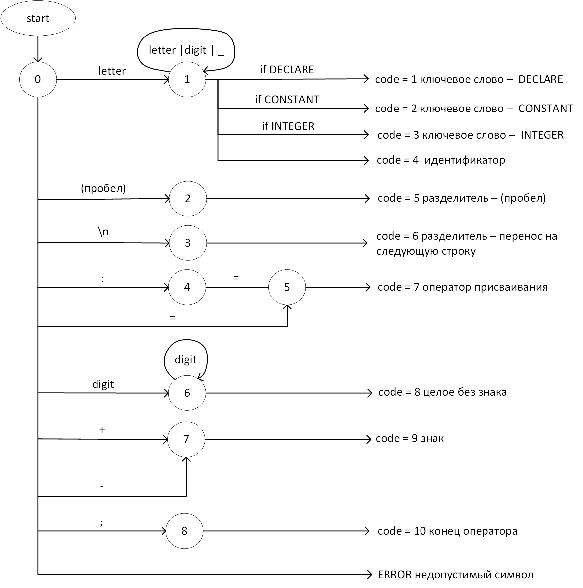


## Лабораторная работа №3: Разработка синтаксического анализатора (парсера)

**Тема:** разработка синтаксического анализатора (парсера).

**Цель работы:** изучить назначение синтаксического анализатора, спроектировать алгоритм и выполнить программную реализацию парсера.

**В соответствии с вариантом задания на курсовую работу необходимо:**

1. Разработать автоматную грамматику.
2. Спроектировать граф конечного автомата (перейти от автоматной грамматики к конечному автомату).
3. Выполнить программную реализацию алгоритма работы конечного автомата.
4. Встроить разработанную программу в интерфейс текстового редактора, созданного на первой лабораторной работе.

## Грамматика

G[<ЦК> = <целочисленная константа>]:

VT = { ‘DECLARE’, ‘CONSTANT’, ‘INTEGER’, ‘a’…’z’, ‘A’…’Z’, ‘0’…’9’, ‘:’, ‘;’, ‘+’, ‘-‘, ‘=’, ‘_’ }

VN = { <ЦК>, E, CONST, INT, ASSIGN, NUMBER, SIGN, UNSIGNEDINT, END, Б, Ц }

P = {

    <ЦК> ? ‘DECLARE’ E
    E ? Б { Б | Ц | ‘_’ } CONST
    CONST ? ‘CONSTANT’ INT
    INT ? ‘INTEGER’ ASSIGN
    ASSIGN ? ‘:=’ NUMBER | ‘=’ NUMBER
    NUMBER ? SIGN UNSIGNEDINT
    SIGN ? [ ‘+’ | ‘-‘ ]
    UNSIGNEDINT ? Ц { Ц } END
    END ? ‘;’
    Б ? ‘a’ | ‘b’ | … | ‘z’ | ‘A’ | ‘B’ | … | ‘Z’
    Ц ? ‘0’ | ‘1’ | … | ‘9’
}

**Классификация грамматики**
Согласно классификации Хомского, грамматика G[Z] является полностью автоматной.

**Граф конечного автомата**

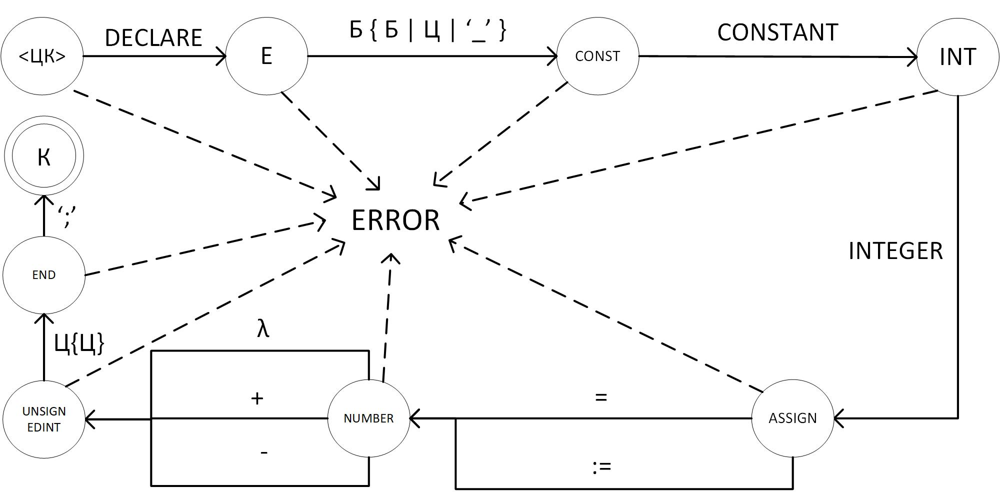


## Лабораторная работа №4: Нейтрализация ошибок (метод Айронса)

**Тема:** нейтрализация ошибок (метод Айронса).

**Цель работы:** реализовать алгоритм нейтрализации синтаксических ошибок и дополнить им программную реализацию парсера.

**Метод Айронса**
Разрабатываемый синтаксический анализатор построен на базе автоматной грамматики. При нахождении лексемы, которая не соответствует грамматике предлагается свести алгоритм нейтрализации к последовательному удалению следующего символа во входной цепочке до тех пор, пока следующий символ не окажется одним из допустимых в данный момент разбора.

**Пример работы программы №1**
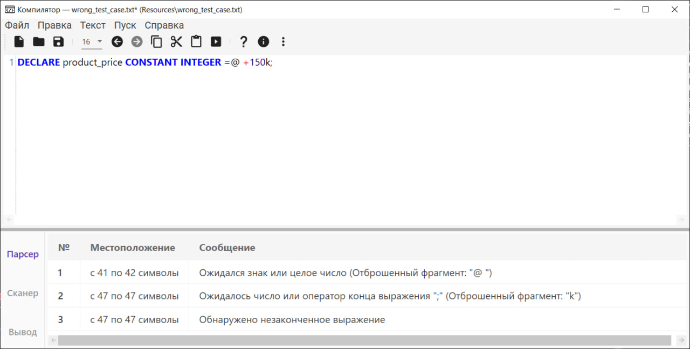

**Пример работы программы №2**
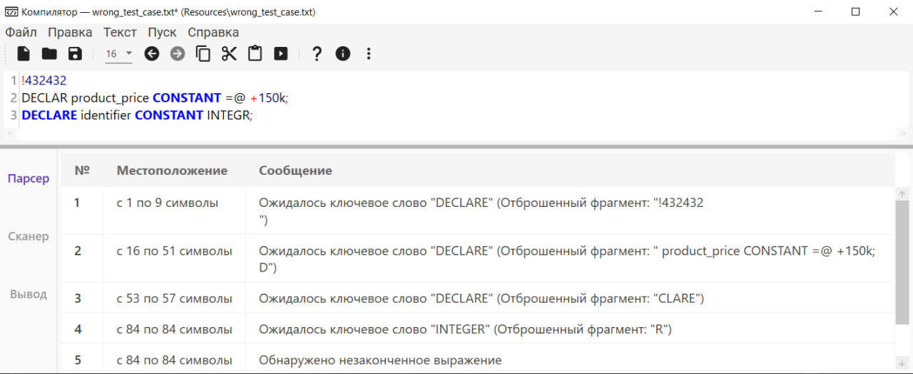

## Лабораторная работа №5: Включение семантики в анализатор. Создание внутренней формы представления программы
**Тема:** включение семантики в анализатор, создание внутренней формы представления программы, используя польскую инверсную запись (ПОЛИЗ).

**Цель работы:** дополнить анализатор, разработанный в рамках лабораторных работ, этапом формирования внутренней формы представления программы.

**Пример работы программы ПОЛИЗ**
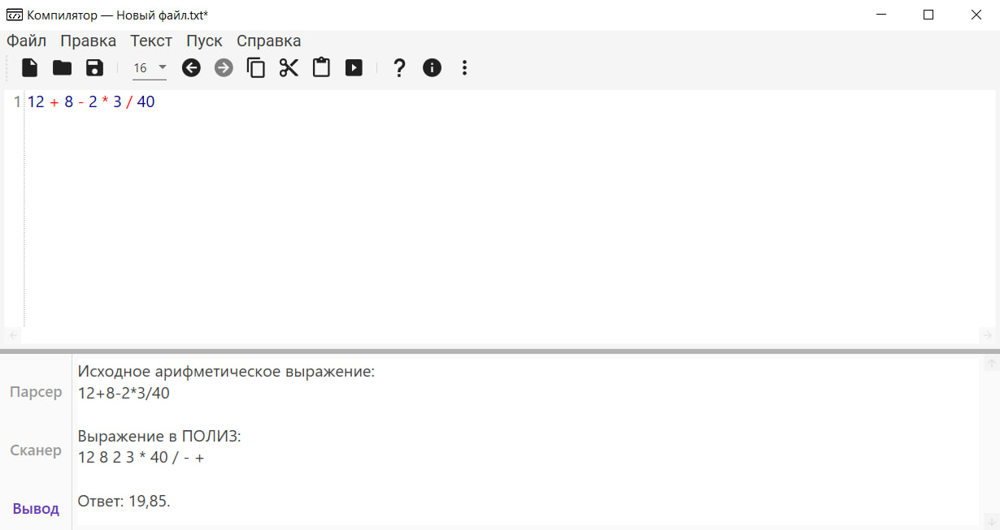

## Лабораторная работа №6: Реализация алгоритма поиска подстрок с помощью регулярных выражений

**Тема:** реализация алгоритма поиска подстрок с помощью регулярных выражений.

**Цель работы:** реализовать алгоритм поиска в тексте подстрок, соответствующих заданным регулярным выражениям.

## Задачи

1. Построить РВ для поиска открывающих HTML-тегов p, li, h3

```
@"<(p|li|h3)(?:\s+[^>]*)?>"
```

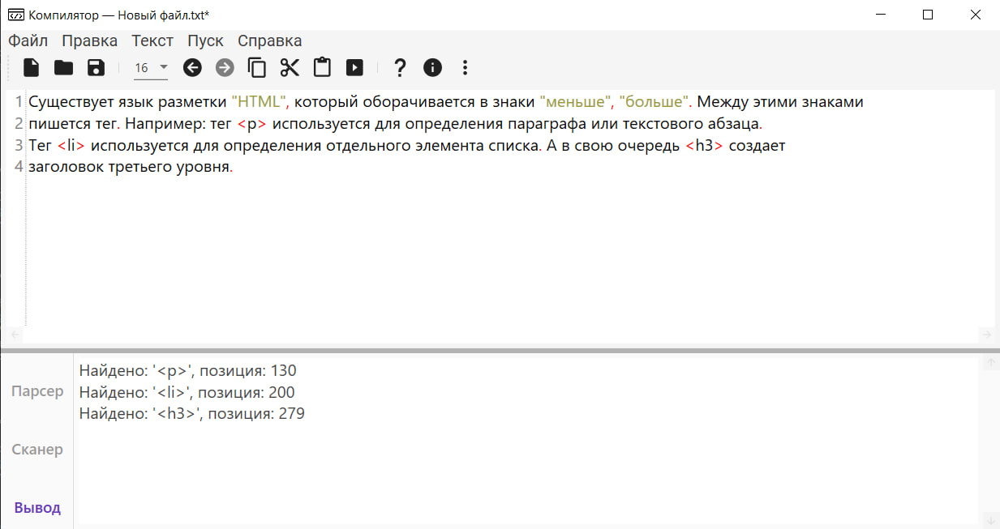

2. Построить РВ для поиска идентификатора, который может начинаться только с буквы a-zA-Z, знака доллара $ или подчеркивания _, оставшаяся часть символов идентификатора представляют собой только буквы a-zA-Z.

```
@"(?:^|\W)([$_a-zA-Z][a-zA-Z]*)(?=\W|$)"
```

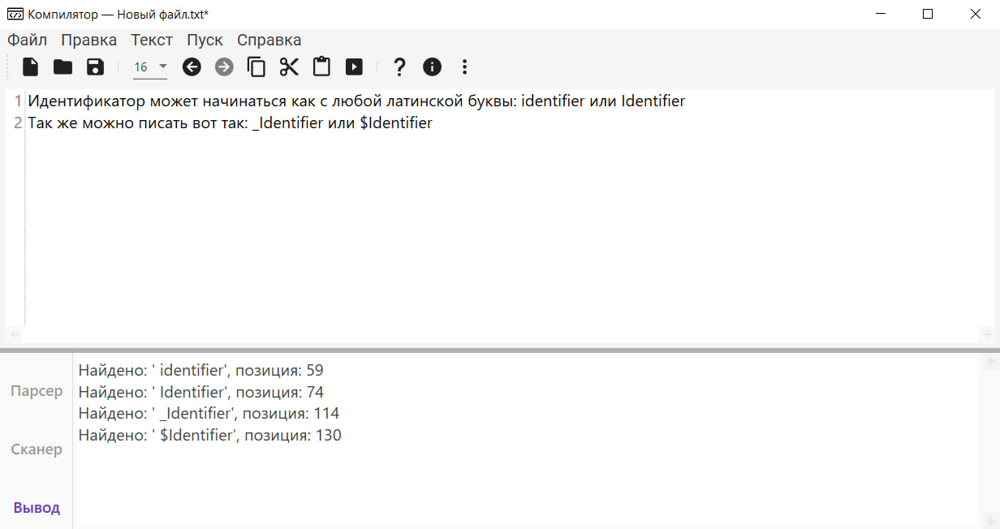

3. Построить РВ, описывающее КПП организации.

```
@"\b\d{2}\d{2}(?:[01][0-9]|[2][0-9]|[3][0-9]|[4][0-9]|50|[5-9][0-9]|[A-Za-z]{2})(?:[0-9A-Za-z]{3})\b"
```
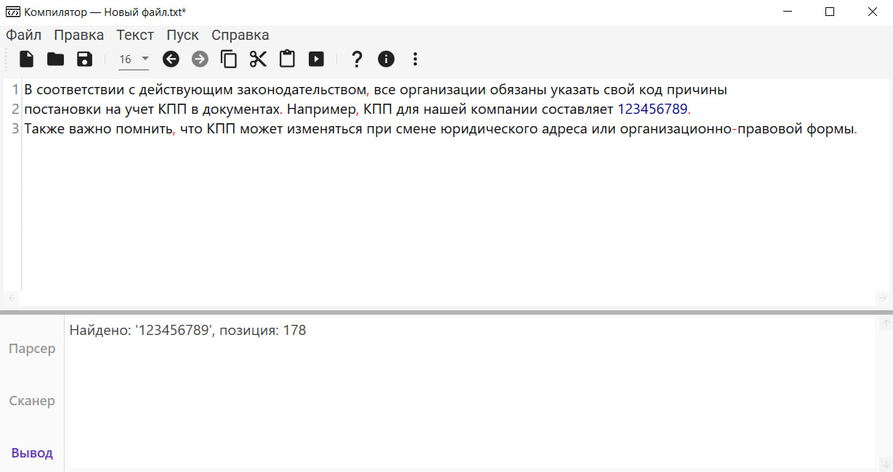

## Лабораторная работа №8. Реализация метода рекурсивного спуска для синтаксического анализа

## Грамматика:
```
G[S]:
1. S → NP VP
2. NP → Pro | PropN | Det A Nom | Det Nom
3. Nom → Nom PP | N Nom | N
4. VP → VP PP | V NP | V NP PP | V PP
5. PP → P NP
N → flight | passenger | trip | morning | ...
V → is | prefers | like | need | depend | fly | ...
A → cheapest | non-stop | first | latest other | direct | ...
Pro → me | I | you | it | ...
PropN → Alaska | Baltimore | Los Angeles | Chicago | ...
Det → the | a | an | this | these | that | ...
P → from | to | on | near | ...
```

## Классификация грамматики
Тип: Контекстно-свободная (КС, тип 2 по Хомскому).
Признаки:
- Левые части правил — одиночные нетерминалы.
- Рекурсия в Nom и VP.

Ограничения:
- Не является автоматной (требует стека для разбора).
- Допускает неоднозначность (например, множественные прилагательные).

## Схема вызова функции:

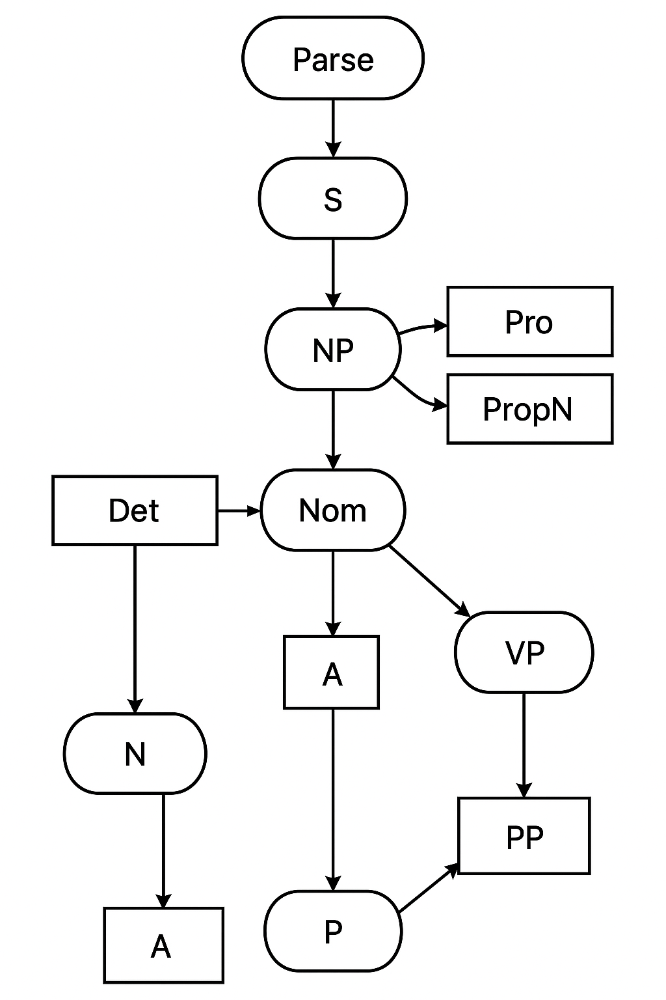

## Тестовые примеры:

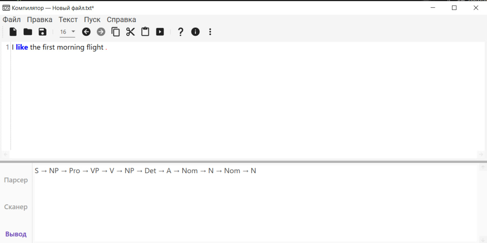
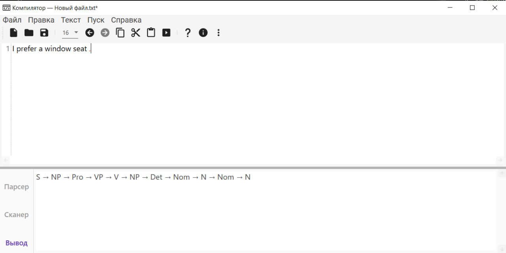
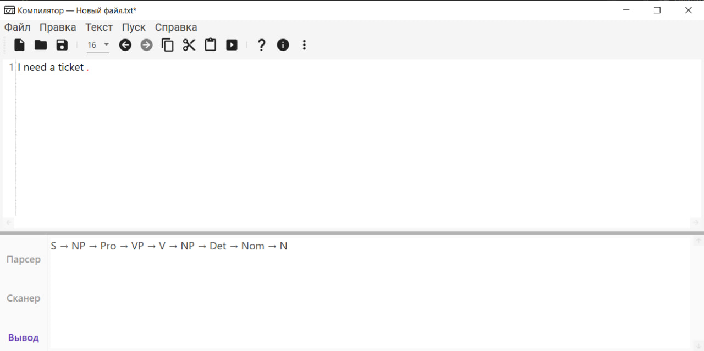
